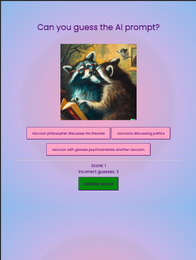
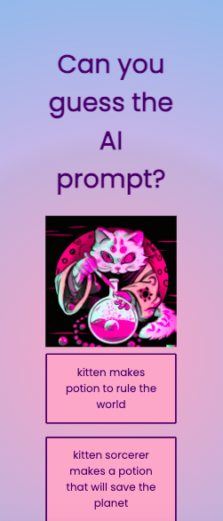
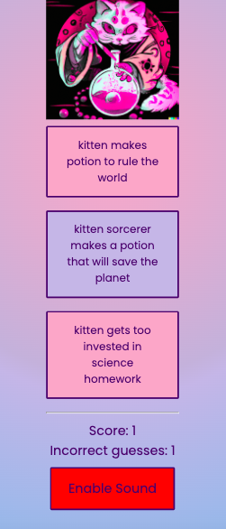
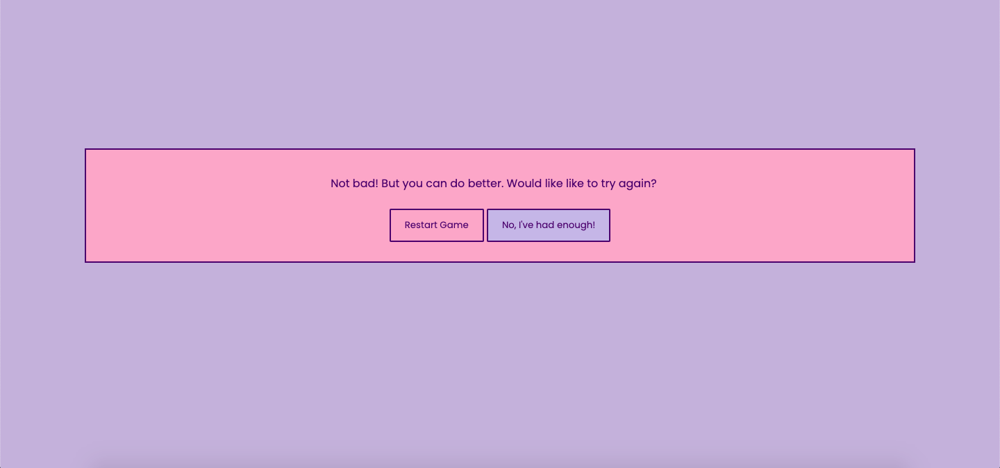
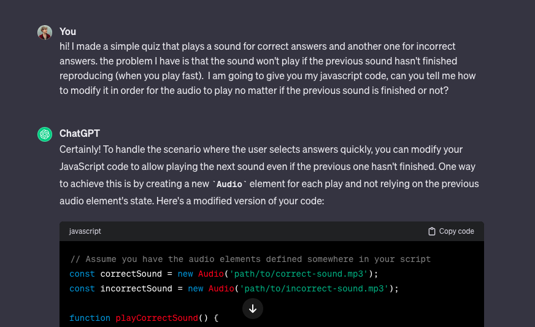

# Guess the AI prompt
This is a quiz game that consists on guessing the prompt that has been fed to the AI (Dalle 3) to produce the image displayed. The goal is to entertain the user and invite them to use their imagination. 
You can look at this project by clicking on the deployed link: https://ikayherce.github.io/guess_the_ai_prompt/

 

 ## Table of contents
### -Description 
### -User demographic 
### -Features
### -Initial planning
### -Existing features
### -Testing
### -Validator testing
### -Unfixed Bugs
### -Development and deployment
### -Credits
 
###  Description 
Guess the AI prompt is a quiz where the questions are AI generated images, and the user needs to guess what the prompt for the artwork is, picking from one of the options provided below the image.
It is not only fun to solve each question by guessing what the prompt was, but also discovering the answers that are at times very surprising. Discovering how AI processes human concepts and ideas is in other words half the fun of this game. 

###  User demographic 
Any internet user who likes riddles and challenging their imagination can play "Guess the AI prompt". However this game might appeal especially to people who are interested in making AI art themselves, and even get inspiration from the images provided. 

This game can unfortunately at this stage not be played by the visually impaired, since the user relies on their sight to guess the answers. I tried to think of a way to adapt the game by using alternative texts but I wasn't satisfied with the result. It could however probably be adapted in some way that I haven't had the time to figure out in the frame of this project. 

###  Features
### Initial planning
My initial planning consisted on a  simple quizz structure with a question that would be an image and answers to choose from below. I made a simple drawing of it on paper.
 I wanted it to be playful, cheerful and provide feedback to the user to provide interactivity. 

### Existing features
#### 15 questions
Basic quizz structure with 15 questions
 

#### Score and Incorrect Answers
Function that keeps track of score and incorrect guesses. 
 
 

#### Feedback to user 
Feedback for correct and incorrect answers in form of audio.
Modal message at the end depending on user score. 

#### Modal window and modal messages 
Modal window at the end of game with two buttons: one refreshing the page to start again and one to stop playing, which directs to google. 

### Design
The basic design of the game is simple and has been chosen to be as clear as user friendly as possible. The image is in the center below the main header, and below the image are the answers to choose from. Below the answers are the score and incorrect answers. 

#### Choice of color palette 
I wanted something colorful and trendy for the background, but at the same time gentle to the eye and not too distracting, since the images are supposed to be the centre of attention. That's why I went with a pastel blue, pink, purple gradient and a white font. The color of the button changes while hovering, but in colors included in the base of the gradient.

The background color with gradient effect was made with the following resource: https://cssgradient.io/

#### Choice of font 
I chose 'Poppins', sans-serif; for a simple but playful look that would match the color palette and overall look of the page.

#### Cursor image
On laptop devices the cursor image is a colorful pastel wand. I chose it to add playfulness and a more refined overall look. The sound choice when the user answer is correct matches the wand cursor, since the chime sound reminds of a magic trick.   

### Testing
#### Manual testing  
* Questions load correctly when a question is answered.
* Sound for incorrect and correct answers load properly.
* Styles load correctly, including the change of color in button when the cursor is hovering. 
* Images load properly. 
* Score for correct and incorrect answers update properly.
* Modal window and correct modal message (according to score) appear when game is finished.
* Upon clicking a button on the modal window user is directed either to the start of the game (if they choose to play again) or google (if they choose to finish playing). 

#### Validator testing
 
 
  

### Unfixed Bugs
When you inspect the website on developer tools the button hover doesn't work properly. It isn't a problem otherwise on either IDE link or deployed github page. 

### Development and deployment
This is what the process has looked like:

1- Creation of empty repository in Github using Code Institute's repository template.  

2- Use of git add and git commit with message in the process of creating my code on Gitpod.

3- Git push to push the local git up to Github. 

4- Deployment from the Github repository  https://ikayherce.github.io/guess_the_ai_prompt/ . 

### Credits
#### Dalle 3 
The images displayed in the quiz have been made with Dalle3. 

#### Help used to code the audio effect

* I used the following resource to get started coding the audio effect for correct and incorrect answers:
https://noaheakin.medium.com/adding-sound-to-your-js-web-app-f6a0ca728984

* The audio files were downloaded from https://uppbeat.io/browse/sfx/fail

* Finally, I got some help from chat GPT in order to make the sound play even when the previous sound iteration isn't finished. I did this since I realised it affected user experience when the quiz is played fast. After googling for a while without finding the right solution chat GPT suggested creating separate objects for each audio file in the checkAnswer function. See screenshots below. 
 
 
 

#### Cursor image  
cursor code: https://blog.logrocket.com/creating-custom-mouse-cursor-css/
https://icons8.com/icons/set/cursor 

#### Modal window
 I started off by providing the user with feedback using alert messages. My mentor pointed out this was not the most effective way of giving feedback. Since the audio effects already provided feedback, I replaced the alert at the end of the quiz for a modal window and different modal messages depending on the score, as well as a message for the user to try the game again (button click refreshes page and directs user to the start again) or finish playing (button click directs user to google) 
 The code for the modal window was taken from the following link and then adapted to my project https://www.w3schools.com/howto/howto_css_modals.asp 
