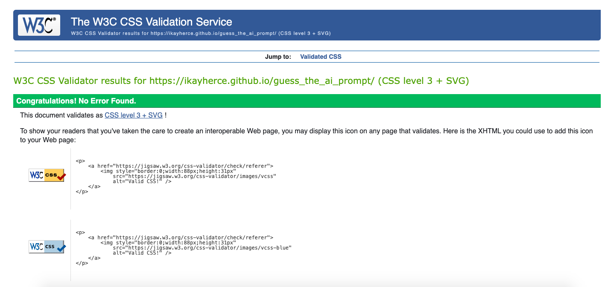
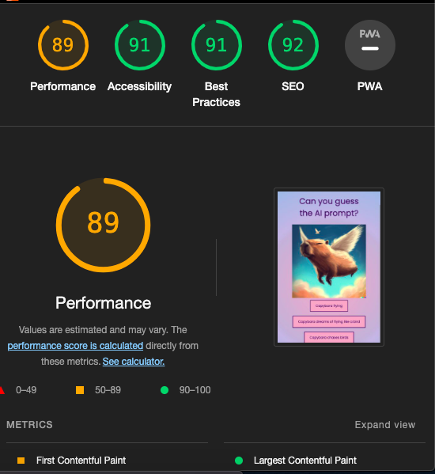

# Guess the AI prompt
This is a quiz game that consists on guessing the prompt that has been fed to the AI (Dalle 3) to produce the image displayed. The goal is to entertain the user and make them use their imagination. 
You can look at this project by clicking on the deployed link: https://ikayherce.github.io/guess_the_ai_prompt/

 

 ## Table of contents
### -Description 
### -User demographic 
### -Features
### -Initial planning
### -Existing features
### -Testing
### -Validator testing
### -Unfixed Bugs
### -Development and deployment
### -Credits
 
### -Description 
### -User demographic 
### -Features
#### 15 questions
#### Score and Incorrect Answers
#### Feedback to user in the form of sound
#### Modal window and modal messages
#### Design
## Design
### Choice of color palette 
Pastels and pink are trendy and appeal to the demographic who dominates in cat cafés. That is why I chose a bold but still soft pink-salmon shade and a cream shade combined  with dark brown text to achieve a good contrast. 
I used https://mycolor.space/ for inspiration and experimented until I found the right combination. 
#### Combinations suggested by https://mycolor.space/ 
 
 
#### Final combination of my choice
 
### Choice of font
I chose 'Tilt Neon' (sans-serif) as the only font for a playful, yet sleek look to the website.  

 

### -Initial planning
### -Existing features
### -Testing
#### - Manual testing 
* Questions load correctly when a question is answered.
* Sound for incorrect and correct answers load properly.
* Styles load correctly, including the change of color in button when the cursor is hovering. 
* Images load properly. 
* Score for correct and incorrect answers update properly.
* Modal window and correct modal message (according to score) appear when game is finished.
* Upon clicking a button on the modal window user is directed either to the start of the game (if they choose to play again) or google (if they choose to finish playing). 

#### -Validator testing
 
 
  

### -Unfixed Bugs

When you inspect the website on developer tools the button hover doesn't work properly. It isn't a problem otherwise on either IDE link or deployed github page. 

### -Development and deployment

This is what the process has looked like:

1- Creation of empty repository in Github using Code Institute's repository template.  

2- Use of git add and git commit with message in the process of creating my code on Gitpod.

3- Git push to push the local git up to Github. 

4- Deployment from the Github repository  https://ikayherce.github.io/guess_the_ai_prompt/ . 

### -Credits
#### Dalle 3 
The images displayed in the quiz have been made with Dalle3. 

#### Help used to code the audio effect

* I used the following resource to get started coding the audio effect for correct and incorrect answers:
https://noaheakin.medium.com/adding-sound-to-your-js-web-app-f6a0ca728984

* The audio files were downloaded from https://uppbeat.io/browse/sfx/fail

* Finally, I got some help from chat GPT in order to make the sound play even when the previous sound iteration isn't finished. I did this since I realised it affected user experience when the quiz is played fast. After googling for a while without finding the right solution chat GPT suggested creating separate objects for each audio file in the checkAnswer function. See screenshots below. 
 
 
 

#### CSS gradient 
The background color with gradient effect was made with the following resource: https://cssgradient.io/

#### Cursor image  
cursor code: https://blog.logrocket.com/creating-custom-mouse-cursor-css/
https://icons8.com/icons/set/cursor 

#### Modal window
 I started off by providing the user with feedback using alert messages. My mentor pointed out this was not the most effective way of giving feedback. Since the audio effects already provided feedback, I replaced the alert at the end of the quiz for a modal window and different modal messages depending on the score, as well as a message for the user to try the game again (button click refreshes page and directs user to the start again) or finish playing (button click directs user to google) 
 The code for the modal window was taken from the following link and then adapted to my project https://www.w3schools.com/howto/howto_css_modals.asp 
